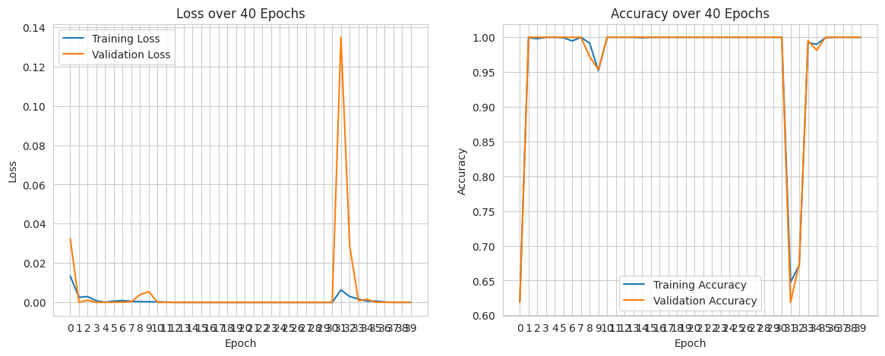
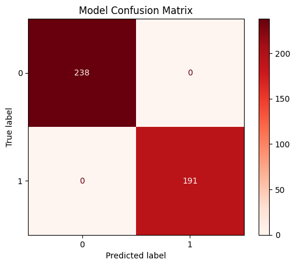
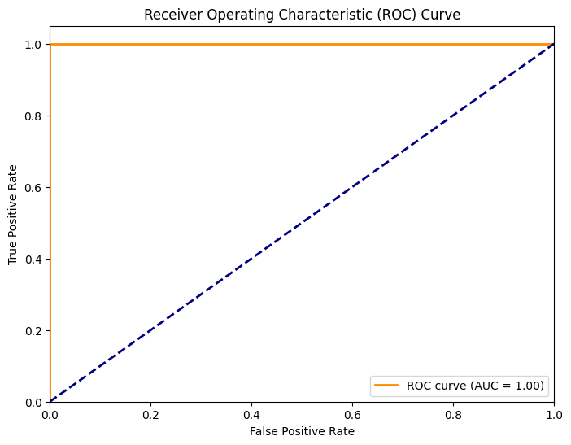

# Breast Cancer Classification using CNN

## Overview

In this project, we use pretrained a pretrained EfficientNet CNN which are finetuned to detect breast cancer. This [dataset](https://www.kaggle.com/datasets/alovestocode/breast-histopathology-images-modified) is used to train the model using PyTorch.

## Table of Contents
+ [Overview](#overview)
+ [Table of Contents](#table-of-contents)
+ [Dataset](#dataset)
+ [Model Architecture](#model-architecture)
+ [Preprocessing](#preprocessing)
+ [Training](#training)
+ [Evaluation](#evaluation)
+ [Usage](#usage)
+ [Dependencies](#dependencies)

## Dataset

This [dataset](https://www.kaggle.com/datasets/alovestocode/breast-histopathology-images-modified) is used which is a trimmed down version of the [Janowczyk A, Madabhushi A. Deep learning for digital pathology image analysis: A comprehensive tutorial with selected use cases. J Pathol Inform. 2016 Jul 26;7:29. doi: 10.4103/2153-3539.186902. PMID: 27563488; PMCID: PMC4977982.](https://pubmed.ncbi.nlm.nih.gov/27563488/)
<br><br>
Dataset contains 2145 images out of which 1189 have negative diagnosis for cancer and the rest positive.


## Model Architecture

We have taken an EfficientNet V2 small model, the final layer of the model is changed as follows:

**Before**: (classifier): Sequential(<br>
    (0): Dropout(p=0.2, inplace=False)<br>
    (1): ReLU()<br>
    (2): Linear(in_features=1280, out_features=1000, bias=True)<br>
)

**After**: (classifier): Sequential(<br>
    (0): Dropout(p=0.2, inplace=False)<br>
    (1): SELU()<br>
    (2): Linear(in_features=1280, out_features=1, bias=True)<br>
)

The model has **20,178,769 parameters** in total.

## Preprocessing

The dataset is split into train, test and validation sets containing 70%, 20% and 10% data respectively. Script for it is given in `Scripts/data-split.py`

The following transform is applied to each image:
```
EfficientNet_transform = Compose([
    ToTensor(),
    Resize((384,384)),
    CenterCrop((384,384)),
    Normalize(mean=[0.485, 0.456, 0.406], std=[0.229, 0.224, 0.225])
])
```

It can be found in `utils.py` file.

## Training

- Training was set for 60 epochs with an early stopping at 12 epochs of validation loss not improving.
- The model is trained using `NAdam optimizer` with an initial learning rate of **0.002** for 40 epochs.
- The loss function used is `BCEWithLogitsLoss`.
- `ReduceLROnPlateau` scheduler has been used to reduce learning rate to 30% of initial in case of validation loss not improving for 7 epochs.
- Batch size is taken as 16.



The script for training the model is in `Scripts/finetune-efficientnet.py`
<br><br>
The model is saved in `Models` folder.

## Evaluation

The model achieves a perfect 100% accuracy on testing dataset.
<br><br>
Confusion Matrix is as follows:
<br>


ROC curve is as follows:


The code for evaluation of the model is given in `Notebooks/Performance.ipynb`

## Usage

The model can be used for detecting breast cancer from chest X-rays and CT scans in medical industry to make the diagnosis of cancer faster and reduce the need for a medical professional at places which might have a shortage.

## Dependencies

All the dependencies in the project are mentioned in __requirements.txt__ file. To install all dependencies run the following command in your terminal:<br>
```
pip install -r requirements.txt
```
